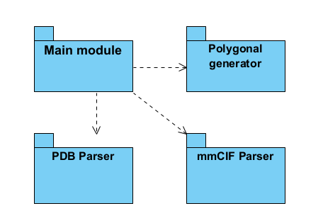

# ARCHITECTURE

## Modules

1. Main Module
2. Parser of PDB files

2. Parser of mmCIF files

3. 3D polygonal ribbon diagram generator

## Main Module

The main application that uses parser modules to read files, generate 3D modules and display them on the game scene using Unreal Engine APIs.

## Parser of PDB

Parses PDB files into internal atom structure.

Reference Go implementation:
https://github.com/fogleman/ribbon/tree/master/pdb

## Parser of mmCIF files

Parses mmCIF files into internal atom structure.

https://github.com/RBVI/readcif

## 3D polygonal ribbon diagram generator

Reference Go implementation:
https://github.com/fogleman/ribbon/tree/master/ribbon