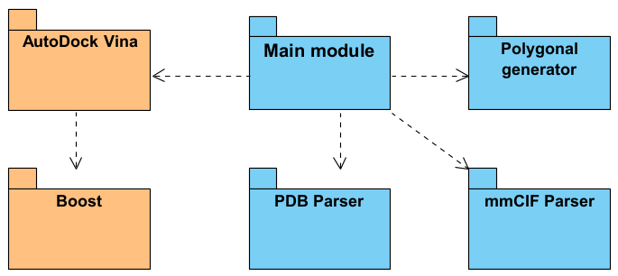

# ARCHITECTURE

## Modules

1. Main Module
2. Parser of PDB files

3. Parser of mmCIF files

4. 3D polygonal ribbon diagram generator
5. Boost set of C++ libraries (second semester)
6. AutoDock Vina tool (second semester)

## Main Module

The main application that uses parser modules to read files, generate 3D modules and display them on the game scene using Unreal Engine APIs.

## Parser of PDB

`Source/ProteinViewer/parsers/pdb` 
Parses PDB files into internal atom structure. 

Reference Go implementation:
https://github.com/fogleman/ribbon/tree/master/pdb

## Parser of mmCIF files

`Source/ProteinViewer/parsers/mmCIF` 
Parses mmCIF files into internal atom structure.  
https://github.com/RBVI/readcif

## 3D polygonal ribbon diagram generator

`Source/ProteinViewer/ribbon` 
Reference Go implementation:
https://github.com/fogleman/ribbon/tree/master/ribbon

## Boost

`Source/Boost` 
Some C++ libraries necessary for work of AutoDock 
https://www.boost.org/

## AutoDock Vina

`Source/Vina` 
Open-source docking engine 
https://github.com/ccsb-scripps/AutoDock-Vina